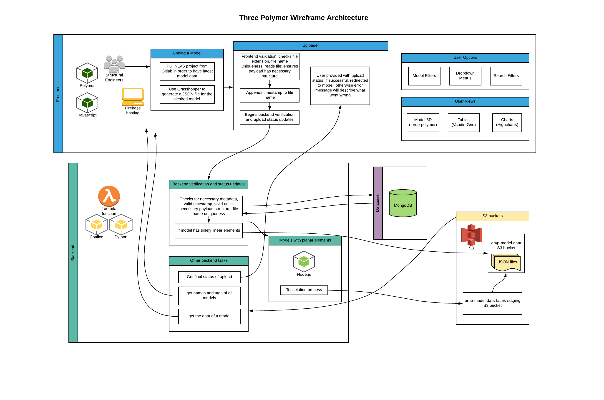

# Three Polymer Wireframe

## What can users do on this site?
- Upload models and view them in 3D
- Have easy access to automated calculations that represent measurements of their different sticks
- Easily calculate of cost for each group of sticks and their subgroups
- Adjust the options under the *Model Filters* heading in order to generate the corresponding data
- View data by group/subgroup represented on a table and a a pie chart that illustrates the numerical proportion of each
- Toggle back and forth between table and chart views
- Share a model with a user via email
- Export any of the data to a CSV file
- Find models by project, office, date range, and/or the user that uploaded it using the search filter

## How do I upload a model?
1. Do a pull request on *Sourcetree* for the *NLVS* project in order to have the latest data of the repo: <https://gitlab.arup.com/nancy.zekioglu/NLVS>
2. Open Grasshopper:
    + Open the *NLVS* folder
    + Go into the *JSON_Sample_Tasks* subfolder
    + Select *ModelToJSON_Qty.gh*
3. Within box for Tekla repo:
    + Toggle boolean to equal *true* next to *connect to database*
    + Next to *Model Groups* select the group for which you'd like to generate a JSON file
4. In the box titled *Target JSON File Location*:
    + Provide the path to the location where you wish to save the generated JSON file
    + Select the category within "Steel Models" for which you'd like to generate a JSON file
    + Toggle the boolean to equal *true* for the JSON you want to generate (concrete or steel)
This will generate a JSON file that will appear in your specified folder
5. Toggle the boolean in the *Target JSON File Location* box back to false
6. Log onto three-polymer-wireframe and select the *+* icon on the top right corner and fill in the fields on the screen

## Contact information
+ Kermin Chok (Kermin.Chok@arup.com): Structural Engineer, Buildings, Los Angeles
+ Trent Clifton (Trent.Clifton@arup.com): Web Developer, Buildings, Los Angeles
+ Rubi Sanchez (Rubi.Sanchez@arup.com): Web Developer, Buildings, Los Angeles

## Web technologies
+ Front end framework/hosting: Polymer 2.0/Firebase
+ Tables: Vaadin-Grid
+ Charting: Highcharts
+ 3D Rendering: three-polymer
+ Serverless Backend: Chalice, Node, AWS Lambda, AWS API Gateway
+ Database: MongoDB

## Lifecycle
All commits to three-polymer-wireframe#master and three-polymer#master will be built and deployed (within a few minutes) to:

https://arup-model-viewer.firebaseapp.com/

## Updating three-polymer-wireframe code
1. Clone the project's repo
2. `cd` into the project folder
3. Run `bower update` to have all app dependencies
4. Run `polymer serve`
5. Visit URL indicated on CLI

## Updating three-polymer reference
three-polymer-wireframe is set to reference the latest on three-polymer#master.  To access a specific git commit, change three-polymer-wireframe/bower.json
```
"three-polymer": "lakopite/three-polymer#{{three-polymer_commit_sha}}"
```

To point back to the default mode
```
"three-polymer": "lakopite/three-polymer#master"
```

## Accessing api in local environment
three-polymer-wireframe accesses a chalice api to retrieve model json data.
In order to connect to the dev url in your local environment, please include a file `local_settings.js` in your project's root directory with the following contents:
```
const _BACKEND_URL_ = "https://<AWS API ID>.execute-api.us-west-2.amazonaws.com/dev/"
//Replace `<AWS API ID>` with actual API ID
```

## App architecture


## What happens when a user uploads a model
When a user uploads a model we perform some steps before it makes it onto its designated s3 bucket:
  1. Append a timestamp for uniqueness to the file name with the following format: *_YYMMDD_HHMMSS*
  2. Check file extension to ensure it is a *.json* file
  3. Ensure that the name within the file matches the name of the actual file and does not already exist in model dropdown
  4. Read the contents of the JSON to ensure that it contains the necessary structure
  5. Inject name, user, project, and office keys into the *modelInformation*
  6. Request the latest status of upload with an ajax call to the Chalice API
  7. Provide status to user; if upload ultimately succeeds, redirect user to the newly uploaded model, otherwise provide the error that occured.  

## Aggregation types
three-polymer-wireframe performs three different aggregation functions. Two of these exist within the quantities tab: numerical aggregations and string aggregations. The third, cost aggregations, exists within the cost tab.

See the flowchart below for a visual representation of the different aggregation types.


1. *_numericalAggregations()*: The element keys within the payload's metadata are shown in the contour dropdown menu; those whose values are numeric fire this function wherein the minumum, maximum, and average sum of each is provided upon selecting it from the dropdown options.

2. *_stringAggregations()*: Elements whose values are a string (e.g. *element type*, *material*, *propertyname*) run this function which calculates sums for the selected contour. Sums are provided for length, mass, and volume of the selected contour and can be viewed by selecting the sum field in the dropdown options.

3. *_costAggregations()*: Calculates the sums of mass and volume for steel and concrete, respectively, by propertyname and its subgroups.
    - *_setCostResults()*: Takes user input from individual rows within the cost column, saves the values, and sets the result for the *Cost Amount* column.  
    - *_updateCostValues()*: If a user enters a new value into a field they had already input, the *costTableData.input* value is updated.
    - *_applyAllCostResults()*: If a user enters a number into the *apply all* field and submits it, the *costTableData.input* values are set, their results (*costTableData.costResult*) are calculated, and the input values are set within the *costItems* object.
    - *costItems* : This object saves user input so that it may be available to them in case of leaving a model's cost tab and later going back to it. If the user updates a value they had already input, it updates it in *costItems.input*.

## Dropdown menus and user options that adjust data


The diagram above illustrates the different dropdown menus that exist within each of the aggregation types as well as how they are created. In order to generate the data that corresponds to them, we take the user input below *Model Filters* (*geometryFilter* object). The *geometryFilter* object is initially set to the *boundaries* (the *boundaries* object is never altered), but a user may change these values as long as they fall within the given boundaries. For example, *geometryFilter.xMin* must always be greater than or equal to *boundaries.xMin* while also ensuring that the *xMin* value is not greater than the *xMax* value. To give us the data that corresponds to the model filters, we use a local variable within each of the aggregation functions: *resultFilterInput*. This takes all elements (both linear and planar), filters out the options that fall outside of the ranges in the model filters, and keeps the relevant data. From there, we can continue with the aggregation function which generally consists of setting the options to populate the dropdown menus above and creating the objects for their table and pie chart (if applicable).

## Tables and charts setup
1. Tables
    - Tool for building: *vaadin-grid*
    - Data structure used: array of objects containing keys that represent each column and its value
        - Example: `tableData = [{'column1': 'sampleName1', 'column2': 123}, {'column1': 'sampleName2', 'column2': 456} ]` would represent the data for a table containing two columns and two rows. Within the *vaadin-grid*, we iterate over the items of `tableData` and set the values of the rows to `item.column1`, `item.column2`. We can then use the information from *tableData* to create the setup for our pie chart.
2. Charts
    - Tool for building: *highcharts*
    - Data structure used: Nested arrays each containing two elements: the row name and the value
        - Example: `pieData=[['sampleName1', 123],['sampleName2', 456]]` we can loop through the objects within *tableData* to grab the information for each and push it onto an array that would look like this example

## How search filters work
1. processSearchOptions(): Sets an object with the different options user can filter by based on models in system.
2. setSearchFilters(): Sets an object with user's input for each search filter field.
    - If user input has no results remove their input
    - If user input has results but the currently selected model is not one of them, reassign the *selectedModel* value to the first search result, otherwise leave the current model as *selectedModel*
3. applySearchFilters(): Compares user input with available models and returns those that fall within the user's search.
